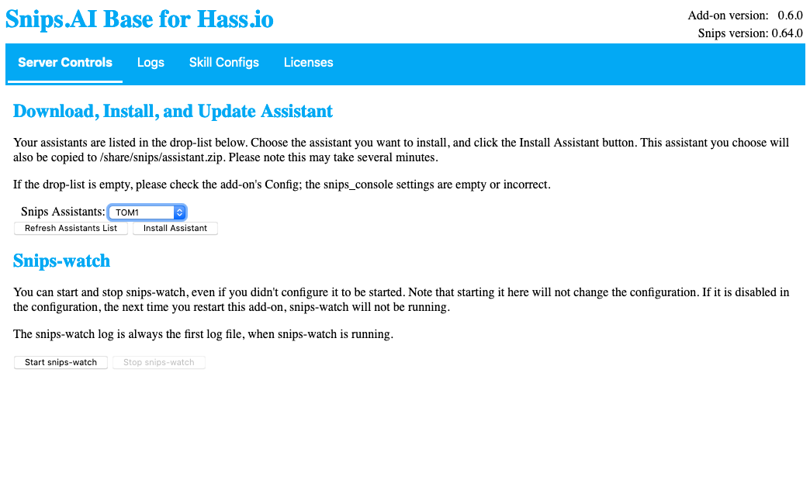

# TOM's Snips.AI Add-on for Hass.io
This is a hass.io add-on repository for TOM's Snips.AI add-on.
To use the add-on in this repository:

1. Go to the Hass.io page
2. Click ADD-ON STORE
3. In the list of Repositories, click on a card that says "Add new repository by URL"
4. Enter the url https://github.com/franc6/snips-hassio-addon
5. Click Add.

The Snips.AI Base add-on should now appear near the bottom of the page under
the heading, "Snips.AI (TOM)"

See [snips-base/README.md](/snips-base/README.md) for more information about
the Snips.AI Base add-on.  Be sure to read
[Add-onConfiguration.md](snips-base/Add-onConfiguration.md) for details
about configuring the Add-on, and
[SnipsConfiguration.md](snips-base/SnipsConfiguration.md) for information on
configuring snips and your skills.

If you'd like to express appreciation for this project...

